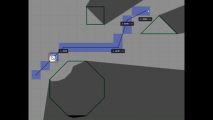

# Limited Attenuation Wall

Adds attenuation vision to limited walls of Foundry VTT.

Foundry always shows the entire area delimited by limited walls. The added attenuation changes the visible area to only a portion near the token, so the other side is not revealed.

## Configuration

In the wall configuration, enable the `Has Limited Attenuation` option and set a ratio in `Limited Attenuation Ratio` from 0.05 (hide 5% of the area) to 0.95 (hide 95% of the area).

## Settings

You can set the `Default Limited Attenuation Ratio` (default is 0.5) to use when enabling `Has Limited Attenuation` in the wall configuration.

# Development

A dev container [configuration](.devcontainer/devcontainer.json) ([see][1]) is provided. It is recommended to make a personal configuration with mounts to your Foundry installation and data folder for easier testing and debugging. Copy `.devcontainer/devcontainer.json` to `.devcontainer/personal/devcontainer.json` and follow the instructions in the comments. This personal folder and suggested mount point are set to be ignored by git.

[1]: https://code.visualstudio.com/docs/devcontainers/containers
